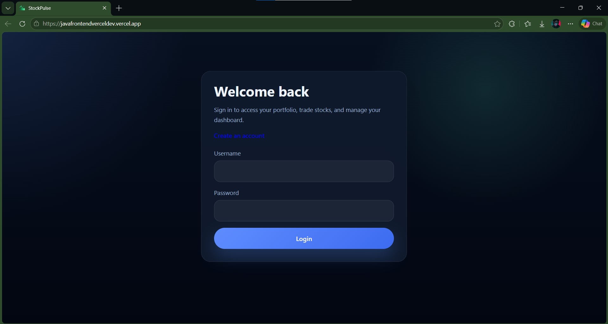
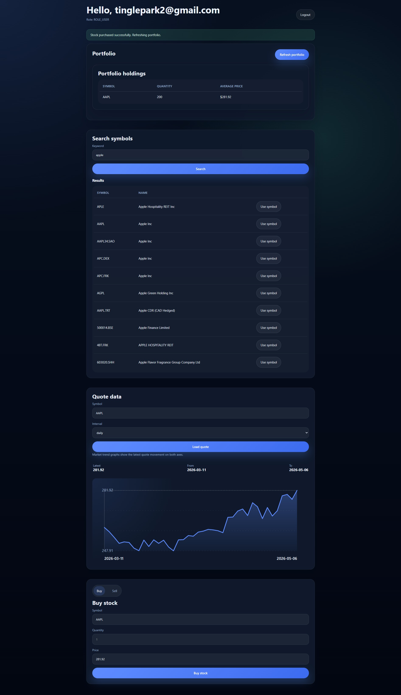
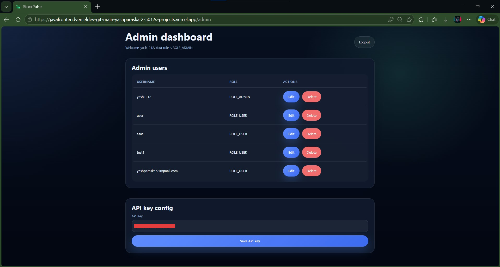

# MarketPulse Frontend

A modern, responsive React frontend for real-time stock portfolio management and trading. Built with **Vite** and **TypeScript** for blazing-fast development and production builds.

🚀 **Live Demo**: [https://javafrontendverceldev.vercel.app/](https://javafrontendverceldev.vercel.app/)

---

## 📋 Overview

MarketPulse Frontend is a feature-rich web application that provides users with:
- **User Authentication** - Secure login and registration
- **Portfolio Management** - View and manage stock portfolios in real-time
- **Trade Execution** - Execute buy/sell orders seamlessly
- **Admin Dashboard** - Comprehensive admin panel for system management
- **Responsive Design** - Works on desktop, tablet, and mobile devices

---

## 🛠 Tech Stack

- **Frontend Framework**: React 18.3.1
- **Build Tool**: Vite 5.4.0
- **Routing**: React Router DOM 6.16.0
- **Language**: TypeScript 5.6.0
- **Styling**: CSS3

---

## 🚀 Quick Start

### Installation

```bash
# Clone the repository
git clone <repository-url>
cd MarketPulse_Frontend

# Install dependencies
npm install

# Start development server
npm run dev
```

The app will be available at `http://localhost:5173`

### Production Build

```bash
# Build for production
npm run build

# Preview production build
npm run preview
```

---

## 📱 App Routes

| Route | Purpose |
|-------|---------|
| `/` | Login/Register page |
| `/home` | User dashboard with portfolio overview |
| `/admin` | Admin panel for system management |
| `*` | 404 Not Found page |

---

## 🔌 Backend Integration

The frontend connects to the live backend API:
```
https://proud-wholeness-production-fc22.up.railway.app
```

### API Communication Features
- ✅ JWT token-based authentication
- ✅ Secure Bearer token authorization headers
- ✅ Automatic error handling (401, 403, 404, 400, 500)
- ✅ User-friendly error messages
- ✅ LocalStorage for session persistence (JWT, username, roles)

---

## 📸 Screenshots

### Login Page


### User Dashboard


### Admin Panel


---

## 🏗 Project Structure

```
src/
├── components/              # Reusable UI components
│   ├── AdminUserTable.tsx
│   ├── ApiKeyEditor.tsx
│   ├── ErrorBanner.tsx
│   ├── PortfolioTable.tsx
│   ├── StockSearch.tsx
│   └── TradeForm.tsx
├── pages/                   # Page components
│   ├── AdminPage.tsx
│   ├── HomePage.tsx
│   ├── LoginPage.tsx
│   ├── RegisterPage.tsx
│   └── NotFoundPage.tsx
├── utils/                   # Utility functions
│   └── auth.ts
├── api.ts                   # API client configuration
├── types.ts                 # TypeScript type definitions
├── App.tsx                  # Main app component
├── main.tsx                 # Entry point
└── styles.css               # Global styles
```

---

## 🔐 Security Features

- **JWT Authentication**: Secure token-based authentication
- **Protected Routes**: Role-based access control (User/Admin)
- **Secure Headers**: Authorization headers with Bearer tokens
- **Session Management**: Persistent login with localStorage

---

## 📝 Features

✨ **User Features**
- Secure login and registration
- Portfolio dashboard with real-time updates
- Stock search and discovery
- Trade execution (buy/sell orders)
- Transaction history

🛡️ **Admin Features**
- User management dashboard
- System monitoring
- API key management
- Application logs and analytics

---

## 🌐 Deployment

Deployed on **Vercel** for optimal performance and reliability.

- **Production URL**: [https://javafrontendverceldev.vercel.app/](https://javafrontendverceldev.vercel.app/)
- **Auto-deployment**: Connected to GitHub (main branch)
- **Performance**: Optimized with Vite's fast builds and Vercel's global CDN

---

## 📦 Available Scripts

```bash
npm run dev       # Start development server
npm run build     # Build for production
npm run preview   # Preview production build locally
```

---

## 🤝 Contributing

Contributions are welcome! Feel free to fork this repository and submit pull requests.

---

## 📧 Authors & Contact

**Yash Paraskar**
- 📧 Email: [yashparaskar2@gmail.com](mailto:yashparaskar2@gmail.com)
- 🐙 GitHub: [https://github.com/Yash010111](https://github.com/Yash010111)

---

## 📄 License

This project is licensed under the MIT License - see the LICENSE file for details.

